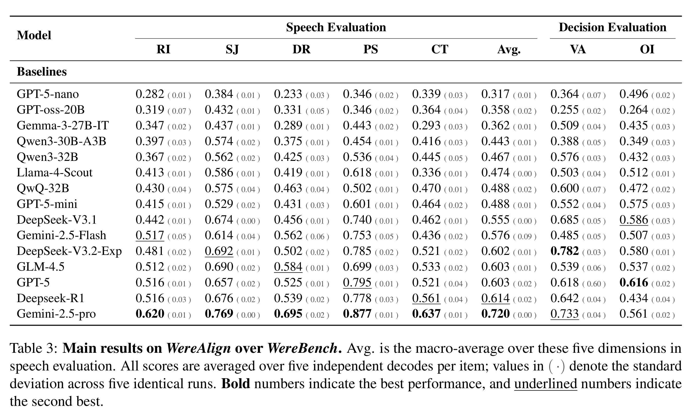

# Beyond Survival: Evaluating LLMs in Social Deduction Games with Human-Aligned Strategies
<p align="center">
  <!-- <a href="https://github.com/ZiruiSongBest/WereBench">
    
  </a>
  <a href="https://arxiv.org/abs/2510.11389">
    
  </a> -->
  <a href="https://huggingface.co/datasets/Yuan4629/WereBench">
    
  </a>
  <a href="https://ziruisongbest.github.io/WereBench/">
    
  </a>
</p>
Social deduction games like Werewolf combine language, reasoning, and strategy, providing a testbed for studying natural language and social intelligence. However, most studies reduce the game to LLM-based self-play, yielding templated utterances and anecdotal cases that overlook the richness of social gameplay. Evaluation further relies on coarse metrics such as survival time or subjective scoring due to the lack of quality reference data. To address these gaps, we curate a high-quality, human-verified multimodal Werewolf dataset containing over 100 hours of video, 32.4M utterance tokens, and 15 rule variants. Based on this dataset, we propose a novel strategy-alignment evaluation that leverages the winning faction's strategies as ground truth in two stages: 1) Speech evaluation, formulated as multiple-choice-style tasks that assess whether the model can adopt appropriate stances across five dimensions of social ability; and 2) Decision evaluation, which assesses the model's voting choices and opponent-role inferences. This framework enables a fine-grained evaluation of models' linguistic and reasoning capabilities, while capturing their ability to generate strategically coherent gameplay. Our experiments show that state-of-the-art LLMs show diverse performance, with roughly half remain below 0.50, revealing clear gaps in deception and counterfactual reasoning. We hope our dataset further inspires research on language, reasoning, and strategy in multi-agent interaction.

**WereBench** is a new benchmark for evaluating the language, reasoning, and strategic capabilities of Large Language Models (LLMs) in social deduction games. The project is based on a high-quality, multimodal Werewolf dataset and introduces a novel evaluation framework called **WereAlign**.

Unlike previous work that relies on coarse metrics like win rates or survival duration, WereAlign enables a more fine-grained evaluation by aligning the model's behavior with the strategies of winning human players. The framework consists of two main components:
*   **Speech Evaluation**: Assesses the model's performance across five dimensions of social ability through multiple-choice questions.
*   **Decision Evaluation**: Assesses the model's voting choices and opponent-role inferences.

Our experiments show that while existing LLMs can generate fluent language, they still have significant shortcomings in strategic reasoning, especially in deception and counterfactual trade-offs.



## Installation Guide

1.  **Clone the repository**
    ```bash
    git clone GITHUB_REPO
    cd WereBench
    ```

2.  **Create and activate a Conda environment**
    ```bash
    conda create -n werebench python=3.9
    conda activate werebench
    ```

3.  **Install dependencies**
    ```bash
    pip install -r requirements.txt
    ```

4.  **Download the Dataset**
    
    We uploaded WereBench to LINK_TO_HF and you can use it conveniently by visiting huggingface.co

## Dataset (WereBench)

WereBench is a curated, human-verified multimodal Werewolf dataset, containing over 100 hours of video, 32.4M utterance tokens, and 15 rule variants.

**Dataset Link**: LINK_TO_HF

## Code Structure

```
.
├── asset # Contains assets like images used in the README
├── data # Directory for the dataset
│   └── ...
├── docs # Directory for page deployment
├── eval # Source code
│   └── ... # Evaluation script
├── requirements.txt # Project dependencies
└── README.md # Project description
```

## Usage

You can use the `eval/Decision_Evaluation/inference.py` script to reproduce the evaluation results from the paper.

```bash
# for Decision Evaluation
python eval/Decision_Evaluation/inference.py

# for Role Performance
python eval/Role_Performance/inference.py
```
*   Make sure you modify the script's call and model to suit your needs before running it

## Evaluation Metrics

Our **WereAlign** evaluation framework consists of two core components:

### 1. Speech Evaluation

We construct a series of multiple-choice questions to assess the model's abilities across five critical social and strategic dimensions:

*   **Role Inference (RI)**: The model's ability to uncover the true identities and intentions of other players.
*   **Strategic Judgment (SJ)**: The model's ability to choose the course of action most beneficial to its faction.
*   **Deception Reasoning (DR)**: The model's ability to identify others' lies or effectively perform masquerades.
*   **Persuasive Statements (PS)**: The model's ability to generate persuasive statements appropriate to the context.
*   **Counterfactual Trade-off (CT)**: The model's ability to examine the potential benefits and risks of different actions under the current scenario.

### 2. Decision Evaluation

Decision evaluation complements the speech-level analysis, further testing whether models choose actions that align with a successful human strategy.

*   **Vote Alignment (VA)**: We score alignment by comparing the model's daytime elimination vote with the MVP's actual vote at the same round, capturing whether the model joins the winning coalition at the right time and on the right target.
*   **Opponent-role Inference (OI)**: The model identifies which players most likely belong to the opposing faction. We compare predictions against ground-truth roles to assess the model's ability to detect inconsistencies and deception in adversaries' speeches.

## How to Cite

If you use WereBench, please cite the project and the associated paper:
