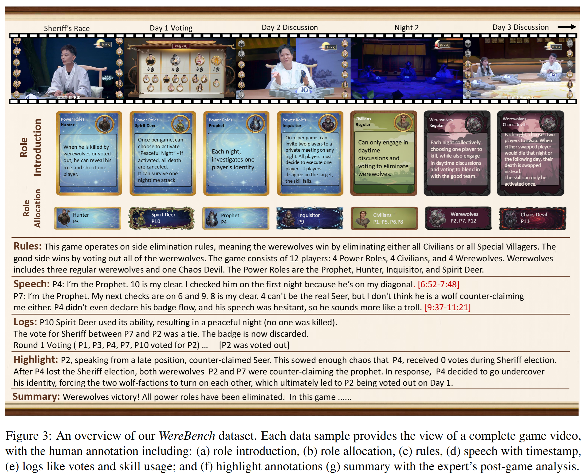

> Benchmarking **role inference** and **logic reasoning** in social deduction games like Werewolf.
---

## Introduction
Social deduction games like Werewolf combine language, reasoning, and strategy, providing a testbed for studying natural language and social intelligence. However, most studies reduce the game to LLM-based self-play, yielding templated utterances and anecdotal cases that overlook the richness of social gameplay. Evaluation further relies on coarse metrics such as survival time or subjective scoring due to the lack of quality reference data. 

To address these gaps, we curate a high-quality, human-verified multimodal Werewolf dataset containing over 100 hours of video, 32.4M utterance tokens, and 15 rule variants. Based on this dataset, we propose a novel strategy-alignment evaluation that leverages the winning faction's strategies as ground truth in two stages: 1) Speech evaluation, formulated as multiple-choice-style tasks that assess whether the model can adopt appropriate stances across five dimensions of social ability; and 2) Decision evaluation, which assesses the model's voting choices and opponent-role inferences. This framework enables a fine-grained evaluation of models' linguistic and reasoning capabilities, while capturing their ability to generate strategically coherent gameplay. Our experiments show that state-of-the-art LLMs show diverse performance, with roughly half remain below 0.50, revealing clear gaps in deception and counterfactual reasoning. We hope our dataset further inspires research on language, reasoning, and strategy in multi-agent interaction.

## WereBench
**WereBench** is a new benchmark for evaluating the language, reasoning, and strategic capabilities of Large Language Models (LLMs) in social deduction games. The project is based on a high-quality, multimodal Werewolf dataset and introduces a novel evaluation framework called **WereAlign**.

Unlike previous work that relies on coarse metrics like win rates or survival duration, WereAlign enables a more fine-grained evaluation by aligning the model's behavior with the strategies of winning human players. The framework consists of two main components:

- **Speech Evaluation**: Assesses the model's performance across five dimensions of social ability through multiple-choice questions.
- **Decision Evaluation**: Assesses the model's voting choices and opponent-role inferences.

## How to use WereBench
**Get started:** read the [Quick Start]({{ "/quickstart" | relative_url }}) ·  
**Check the data:** [Dataset]({{ "/dataset" | relative_url }}) ·  
**Results figure:** [Leaderboard]({{ "/leaderboard" | relative_url }})

---

## Citation
If you use WereBench, please cite the paper: