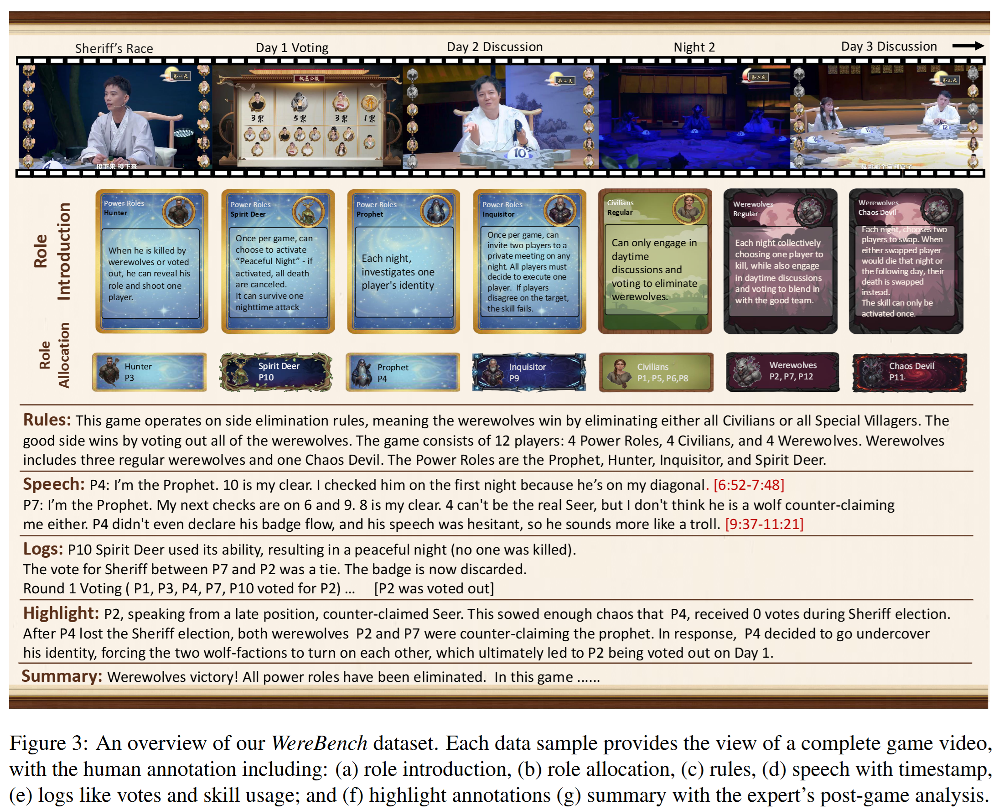

# WereBench

> Benchmarking **role inference** and **logic reasoning** in social deduction games like Werewolf.

<!-- {: .mt-4 .mb-4 } -->

[Paper](https://arxiv.org/pdf/2510.11389){: .btn .btn-primary .mr-2 }
[Code](https://github.com/ZiruiSongBest/WereBench){: .btn .mr-2 }
[Dataset](https://huggingface.co/datasets/Yuan4629/WereBench){: .btn .mr-2 }
[Quick Start]({{ "/quickstart" | relative_url }}){: .btn .btn-outline }

---

## Overview
**WereBench** is a new benchmark for evaluating the language, reasoning, and strategic capabilities of Large Language Models (LLMs) in social deduction games. The project is based on a high-quality, multimodal Werewolf dataset and introduces a novel evaluation framework called **WereAlign**.

Unlike previous work that relies on coarse metrics like win rates or survival duration, WereAlign enables a more fine-grained evaluation by aligning the model's behavior with the strategies of winning human players. The framework consists of two main components:

- **Speech Evaluation**: Assesses the model's performance across five dimensions of social ability through multiple-choice questions.
- **Decision Evaluation**: Assesses the model's voting choices and opponent-role inferences.

## How you use WereBench
**Get started:** read the [Quick Start]({{ "/quickstart" | relative_url }}) ·  
**See the data:** [Dataset]({{ "/dataset" | relative_url }}) ·  
**Results figure:** [Leaderboard]({{ "/leaderboard" | relative_url }})

---

## Citation
If you use WereBench, please cite the paper: